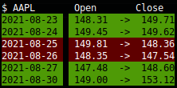

# stock-ticker-py
A simple python3 script to print a rough week's worth of daily stock information to the terminal.
Requires `yfinance`, `sys`, `datetime` modules.
The script takes a single stock ticker as input, for example:
```
$ stock-ticker.py AAPL
```
Which will return:


